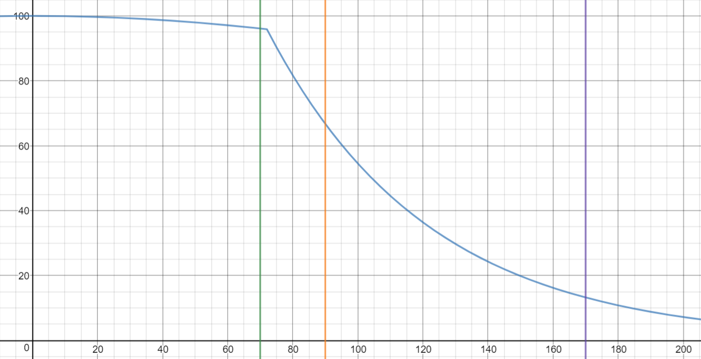

## Intentions

The idea here is to turn the factory machine into a 2 stage puzzle:  
1) Figure out how the machine works, simply solve for purity.  
2) Optimize your algorithm, solve for tenacity.  

Story wise, the visit to the factory to gather data will be kept.  
This will be the players' opportunity to become comfortable with the factory environment / learn about the refinery.  
After returning the FactoryData to the Lodge / perhaps after investigating the Mayor, there would be another quest to return to the factory to manufacture tools.  
E.g. "go get 2 keys and a hackdev for us".  
Optimizing should be optional, but the benefits of doing so should be clearly communicated (a censored floppy somewhere explaining tenacity)  

Ideally the redesign maintains that the default algorithm performs very poorly / struggles to create basic hackdevs.  
The "illegal" ministry algorithm should be able to reliably create hackdevs with utility APIs, but unlikely to create powerful APIs.

 

## The Original Puzzle

You are given an array of 16 random numbers in range [0, 25]  
the following operations are available:

### `Refine(int index)`
reduce the number at a given index by a random amount in range [1, 5]  
there is a 1/7 chance that the number will degrade to a random value in range [20, 25] instead

 

### `GetPurity()`
compute the purity score (sum of scores per value in array)  
for values in range [7, 25] the score is `0`  
for all other values, refer to this table
|value|score|
|:---|---:|
|0|1|
|1|0.75|
|2|0.5|
|3|0.4|
|4|0.3|
|5|0.2|
|6|0.1|

 

## Your Task
modify the array such that its purity score exceeds 14.4

 

## Analysis
Observing the runtime of algorithms (Purity > 90%):
|Algorithm|# Cases|Avg Steps|Best 1%|Worst 1%|time|
|:---|---:|---:|---:|---:|---:|
|Default|100,000|never|never|never|3516 ms|
|MD11_SkipMax|100,000|158.45|67.72|295.57|627 ms|
|RandomNonZero|100,000|158.39|68.05|294.28|1056 ms|
|Interleave|100,000|158.38|68.54|293.29|776 ms|
|MinistryData11|100,000|158.35|68.12|294.26|578 ms|
|MaxFirst|100,000|155.21|67.95|285.23|1068 ms|
|MinFirst|100,000|153.76|63.53|289.28|829 ms|

---

 

## Suggested Revision

There is an additional stat `tenacity` that decreases when refining.  
Values refine proportional to their difference with their neighbors.  

### `Refine(int index)`
Reduce the value at a given index by `Floor(Abs(AverageNeighborValue - value) / 3) + 1`.  
If the value is 0, the value should be increased instead.  

### `GetPurity()`
compute the purity score (sum of scores per value)  
the score per value is given by `score = 1 - (value / 12.5)`

 

### Tenacity Levels:
|tenacity|function unlock|
|---:|:---|
|> 90%|GetName(), CopyToClipboard(), GetUser() and GetRoom()|
|> 75%|Connect() and RemoteFunctionCall()|
|> 50%|StringContains(), ToLower(), ToUpper(), CharToInt(), IntToChar(), MemoryAPI|
|> 25%|Sleep(), Random(), PlaySound()|
|<= 25%|default functionality|

### Purity Levels:
|purity|device|
|---:|:---|
|(90%, 100%]|Hackdev|
|(70%, 90%]|Key|
|(50%, 75%]|MysticalCube|
|(25%, 50]|Floppy|
|[0%, 25%]|Screwdriver ("junk")|

 

## Analysis
Observing the runtime of algorithms (Purity > 90%):  
|Algorithm|# Cases|Avg Steps|Best 1%|Worst 1%|time|
|:---|---:|---:|---:|---:|---:|
|Default|100,000|160.36|83.02|286.59|916 ms|
|MaxFirst|100,000|131.38|59.81|219.20|905 ms|
|Greedy max|100,000|95.71|51.85|142.42|1734 ms|
|RandomNonZero|100,000|93.54|46.07|159.35|704 ms|
|MinistryData11|100,000|91.21|51.21|131.85|517 ms|
|MD11_SkipMax|100,000|89.86|51.30|128.95|755 ms|
|Interleave|100,000|74.11|44.47|104.00|586 ms|
|MinFirst|100,000|69.83|41.42|102.42|586 ms|

 

## Tenacity formula

Since there is still a random element in the initial state of the mineral, the tenacity formula should be considered carefully.  

This one seems appropriate: `tenacity = 0.98 ^ max( (x/50)^2 , (x-70) )`  
The x axis is the amount of steps taken.  
The vertical lines indicate the average steps of these algorithms:
* green - MinFirst
* Yellow - MinistryData11
* Purple - Default

Below is a table listing the amount of retries of some algorithms to create a hackdev while maintaining the tenacity level.  
Table can be read as "in >=95% of the cases, algorithm x creates a hackdev of tenacity y in at most z attempts".

|Tenacity|Max Steps|MinFirst|MD11|Default|
|---:|---:|---:|---:|---:|
|> 90%|75|3|23|-|
|> 75%|85|2|9|553|
|> 50%|104|1|3|64|
|> 25%|138|1|1|9|